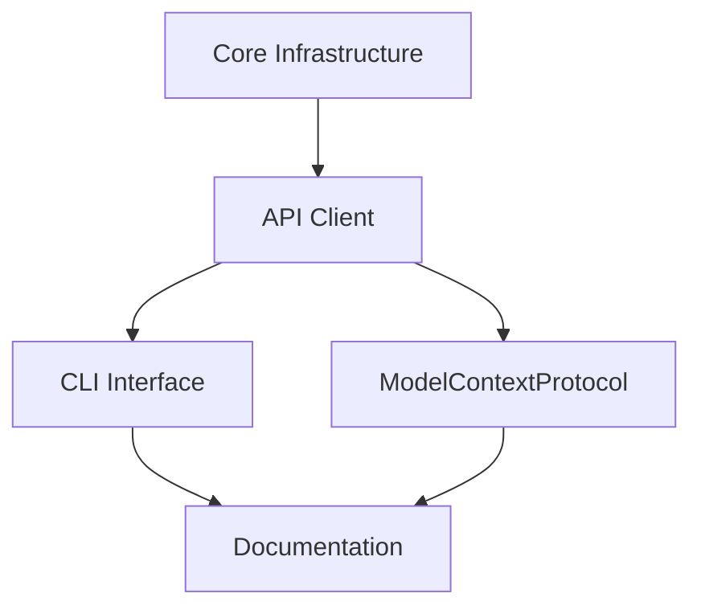

# Project Implementation Plan

## Overview

This plan outlines the implementation sequence for the Buttondown API client, following a test-driven development approach. Each chunk represents a discrete, testable unit of work.

## Implementation Sequence

### Phase 1: Core Infrastructure (✅ Completed)

- TypeScript setup
- pnpm workspace
- ESLint configuration
- Jest setup
- Build process
- Git repository

### Phase 2: API Client (✅ Completed)

- Base HTTP client
- Authentication system
- Request/response types
- Error handling
- Email management
- Scheduling system
- Analytics retrieval

### Phase 3: Interfaces (🚧 Current Focus)

#### CLI Interface (Chunk 01)

- Command parser
- Command executors
- CLI entry point
- Integration tests
- Documentation

#### ModelContextProtocol Interface (Chunk 02)

- Protocol handler
- Command processor
- Response formatter
- Integration tests
- Documentation

### Phase 4: Documentation & Polish

- API documentation
- Usage examples
- Contributing guidelines
- README updates
- Final integration tests

## Dependencies

## Risk Assessment

### High Risk Areas

1. API rate limiting
2. Error handling edge cases
3. State management in ModelContextProtocol

### Mitigation Strategies

1. Implement rate limiting detection and backoff
2. Comprehensive error test cases
3. Clear state management documentation

## Timeline

1. CLI Interface (Chunk 01)

   - Estimated: 3-4 days
   - Dependencies: Core API client
   - Status: Not started

2. ModelContextProtocol (Chunk 02)

   - Estimated: 2-3 days
   - Dependencies: Core API client
   - Status: Not started

3. Documentation & Polish
   - Estimated: 2-3 days
   - Dependencies: All interfaces complete
   - Status: Not started

## Check-in Points

1. After CLI interface completion:

   - All commands working
   - Integration tests passing
   - Documentation started

2. After ModelContextProtocol completion:

   - Protocol handler working
   - LLM interaction verified
   - Integration tests passing

3. Final review:
   - All features complete
   - Documentation comprehensive
   - All tests passing
