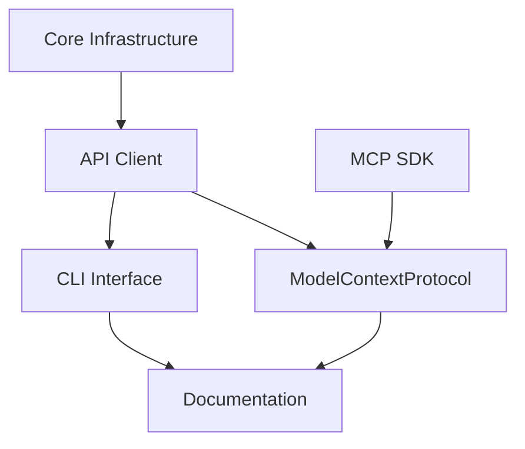

# Project Implementation Plan

## Overview

This plan outlines the implementation sequence for the Buttondown API client, following a test-driven development approach. Each chunk represents a discrete, testable unit of work.

## Implementation Sequence

### Phase 1: Core Infrastructure (✅ Completed)

- TypeScript setup
- pnpm workspace
- ESLint configuration
- Jest setup
- Build process
- Git repository

### Phase 2: API Client (✅ Completed)

- Base HTTP client
- Authentication system with lazy validation
- Request/response types
- Error handling
- Email management with status filtering
- Scheduling system with ISO 8601 support
- Analytics retrieval
- Efficient API key handling

### Phase 3: Interfaces (🚧 Current Focus)

#### CLI Interface (Chunk 01)

- Command parser
- Command executors
- CLI entry point
- Integration tests
- Documentation

#### ModelContextProtocol Interface (Chunk 02) (✅ Core Features Completed)

- Protocol handler
- Command processor
- Response formatter
- Tool implementations:
  - list_emails with status filtering ✅
  - create_draft ✅
  - get_analytics ✅
  - schedule_draft with ISO 8601 support ✅
- Parameter validation with Zod ✅
- Tool descriptions ✅
- Inspector support ✅
- Integration tests (In Progress)
- Documentation (In Progress)

### Phase 4: Documentation & Polish (🚧 In Progress)

- API documentation
- Usage examples
- Contributing guidelines
- README updates
- Final integration tests
- MCP tool documentation
- API key setup guide
- Scheduling guide

## Dependencies

## Risk Assessment

### High Risk Areas

1. API rate limiting
2. Error handling edge cases
3. State management in ModelContextProtocol
4. Email scheduling edge cases
5. API key validation timing

### Mitigation Strategies

1. Implement rate limiting detection and backoff
2. Comprehensive error test cases
3. Clear state management documentation
4. Thorough schedule validation
5. Efficient API key validation

## Timeline

1. CLI Interface (Chunk 01)

   - Estimated: 3-4 days
   - Dependencies: Core API client
   - Status: Not started

2. ModelContextProtocol (Chunk 02)

   - Estimated: 2-3 days
   - Dependencies: Core API client, MCP SDK
   - Status: Core features complete, testing and documentation in progress
   - Completed:
     - Tool implementations
     - Parameter validation
     - Inspector support
     - API key optimization
     - Email scheduling
   - Remaining:
     - Integration tests
     - Documentation
     - Error handling improvements

3. Documentation & Polish
   - Estimated: 2-3 days
   - Dependencies: All interfaces complete
   - Status: In progress
   - Focus areas:
     - MCP tool documentation
     - API key setup guide
     - Scheduling documentation
     - Error handling guide

## Check-in Points

1. After CLI interface completion:

   - All commands working
   - Integration tests passing
   - Documentation started

2. After ModelContextProtocol completion:

   - Protocol handler working ✅
   - LLM interaction verified ✅
   - Tool implementations complete ✅
   - Parameter validation working ✅
   - Inspector support added ✅
   - API key optimization implemented ✅
   - Email scheduling working ✅
   - Integration tests passing (In Progress)
   - Documentation complete (In Progress)

3. Final review:
   - All features complete
   - Documentation comprehensive
   - All tests passing
   - API key handling optimized
   - Email scheduling validated
